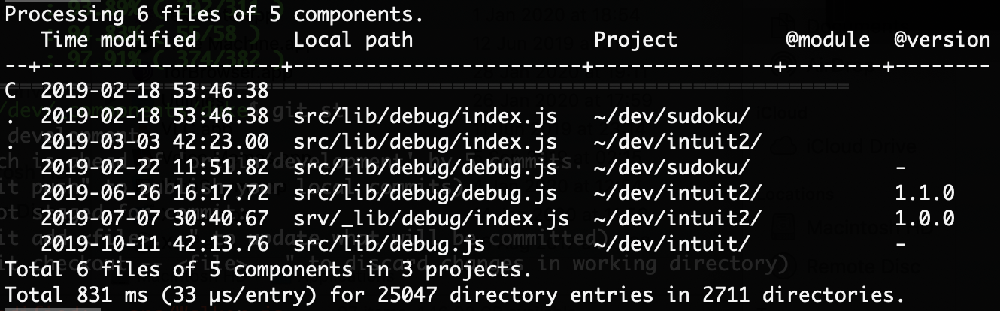

# dwalker [](https://travis-ci.org/valango/duke) [](https://codecov.io/gh/valango/duke)


Rule-based file directory walker - ambitious 
alternative to globber-based directory walkers.

**WARNING:** This is _**development** branch_ README and
it may be lagging real bad behind actual codebase changes.

Once I decided to write an utility for managing multiple npm projects.
The first challenge was to implement a listing functionality able to identify
identical modules used in different projects according to search criteria specified. 
I wanted something like this:



by entry types and get report like this:
```
       directory: 4370
            file: 38392
         symLink: 105
Total 1210 ms (28 µs per item), max directory depth: 8.
The deepest directory:
../sincere/node_modules/resolve/test/resolver/symlinked/_/node_modules
```

How to get there? Just take a look to
[examples/count.js](examples/count.js) 
or better yet - clone the project and play around a bit.

## Usage
**NB:** This package needs Node.js v12.12 or higher.

Install with npm

```
npm i dwalker
```

### How it works
**`Walker`** class instance has `walk()` method,
which does most of the job. It traverses directory hierarchy width-first,
calling application-defined handlers, as it goes. The walk() code
is re-enterable and it can run in parallel promise instances.

Simplified internal algorithm use by `walk()` and `walkSync()` methods:
```javascript
function walk_ (root, options) {
  let action, context, directory
  const walkContext = defaults({}, options, this.options)
  const fifo = [{ dir: '', locals: walkContext.locals || {} }]

  while (!this.terminate && (context = fifo.shift()) !== undefined) {
    const { dir } = context

    directory = fs.opendirSync(join(root, dir))
    if ((action = onBegin(context)) === DO_ABORT) break
    if (action === DO_SKIP) continue

    while (({ name, type } = directory.readSync())) {
      action = onEntry({ name, type, ...context })
      if (action === DO_ABORT) discardPushedEntriesAndBreak()
      //  The entries pushed here will be processed next.
      if (action !== DO_SKIP && type === 'dir') fifo.push({dir: join(dir, name)})
    }
    directory.closeSync()

    if ((action = onEnd({action, ...context})) === DO_ABORT) break
  }
  return walkContext.error ? walkContext.error : walkContext
}
```
Application - specific handlers `onBegin`, `onEnd`, `onEntry` and 
`onError` are all optional, but 
`Walker` just won't do much good without them.

Things really get exciting, when we apply some business logic in our handlers.
See [another example](examples/list.js).

## API
**_Deprecated:_**
  1. v1.0.1 Ruler instance method call syntax `.add(definition, action)`;
  1. v2.0.0 Ruler constructor `'action'` option - use `'defaultAction'`;
  1. v2.0.0 Walker constructor `'defaultRules'` option - use `'defaultRuler'`;
  
### Class `Walker`
For flexibility, `Walker` supports overriding some it's instance methods
by plug-ins. Maybe it will be strictened in future releases as
usage patterns will stabilize, but until then... enjoy!

**`constructor([options], [sharedData])`** <br />
`sharedData={} : *` initial value assigned (not copied) to `data`.<br />
`Walker` recognizes the following `options : {object}`:
   * `interval=200 : {number}` milliseconds between `tick()` plug-in calls;
   * `defaultRuler= : {Ruler} | *` rules or Ruler instance for defaultRuler property;
   * `detect : {function()`} plug-in override for `detect` method;
   * `talk : {function()}` used by `talk()` instance method;
   * `tick : {function()}` plug-in to be repeatedly called during walking;
   * `onBegin | onEnd | onEntry | onError' | {function(*):*}` - handler plug-ins.

**`data`**: `{*}` property <br />
is not used by `Walker`, 
but can be used by plug-ins or derived classes.
This property set to `sharedData` or `{}` by constructor.

**`failures`**: `{Array<string>}` property <br />
Soft error messages; can be examined any time.

**`options`**: `{object}` property <br />
is copy of constructor options. `walk()` some methods look here for plug-ins.

**`defaultRuler`**: `{Ruler}` property <br />
`onBegin()` method assigns it to `context.ruler` by default.

**`terminate`**: `{boolean}` property <br />
assigning _Truey_ value prevents any further walking. 
`Walker` sets it `true`, when any `onXXX` handler returns `DO_TERMINATE`.

**`tree`**: `{object[]}` property <br />
list of recognized subtrees, e.g. Node.js projects. get... methods assume
array members having `absDir : string` property.

**`detect(context)`**  method<br />
called by `onBegin()` method.
Should check if the current directory has special importance and if so,
it should add and entry to `trees` instance property and possibly change `context.ruler`.

**`getCurrent(path)`**`{object}`  method<br />
returns `tree` instance property member with `dirPath === path` or `undefined`.
Called by `Walker.onBegin()` method.

**`getMaster(path)`**`{object}`  method<br />
returns `tree` instance property member with `dirPath` shorter than `path`
and matching it's beginning, or `undefined`.
Called by `Walker.onBegin()` method.

**`onBegin | onEnd | onEntry | onError`**: `{*}` method <br />
If plug-in is defined, it will be called instead of instance method.
Both plug-ins and instance methods semantics is described
in [handlers](#handlers) chapter.

**`registerFailure(failure, [comment])`**: `{Walker}` method<br />
The `failure` should have `stack` or `message` property or default conversion to string.
The resulting string is pushed to `failures` property.
If `comment : {string}` is present, it will be appended to message after `'\n  '` string.

**`talk(...args)`**: `{Walker}` method<br />
executes `options.talk`. For debugging only!

**`walk(rootDir, [options])`**: `{Promise}` method<br />
walks the directory tree asynchronously starting from `rootDir` down.
If `options.locals` is present then it will be assigned to `locals` property of the _top context_.
Returns a promise resolving to _walk context_ or rejecting to un-handled `Error` instance.

**`walkSync(rootDir, [options])`**: `{object}` method<br />
Synchronous version of `walk()` method.
Returns _walk context_ or throws `Error`.

### Default error processing
It may make sense to read about [handlers](#handlers) first and then continue from here.

Depending on `error.code` value, the following will happen:
   * `'ENOTDIR'` - error is not logged and `DO_SKIP` is returned from behalf of failed function;
   * `'EPERM'` - error is logged and execution continues;
   * otherwise it is assumed to be unexpected failure and then:
      * registerFailure() is applied to original arguments of the failed call and then
      to the error instance;
      * DO_ABORT will be returned so this Walker instance finishes walking.
      
Resulting dump of failures property will look something like this:

   
If exception originates from `onEnd` handler and final code is not `DO_SKIP`,
then `walk()` will return immediately.

### Class `Ruler`
_`Walker`_ is not directly dependent on this class, but it is designed specially
to work with it. **NB:** It scans it's rule tree most recently added rules first.

**`constructor([options], [...rules])`** <br />
calls if `rules` are supplied, `add()` method  invoked. Available `options` are:
   * `defaultAction : {number}   ` - initial value for `defaultAction` property.
   * `extended : {boolean}` - enables sets '{a,b}' -> '(a|b)'; default: `true`.
   * `optimize : {boolean}` - enables rule optimization; default: `true`.

**`ancestors`**: `{Array<Array>}` property <br />
Affects results of `test( , true)` instance method call and may be mutated by it.

**`defaultAction`**: `{integer}` property <br />
default action to be bound to new rule.
This value is used and possibly mutated by `add()` method.

**`add(...args)`**: `{Ruler}` method <br />
adds new rules. Any numeric item in `args` array
will be treated as action code for further rules and will also
mutate `defaultAction` property.
Rules array may be nested for clarity.
All code lines following example are functionally identical: 
```javascript
r.add(DO_SKIP, 'node_modules', '.*', DO_DEFAULT, '*.js', 'test/*spec.js')
r.add([DO_SKIP, 'node_modules', '.*', DO_DEFAULT, '*.js', 'test/*spec.js'])
r.add(['node_modules', '.*'], DO_SKIP).add([DO_DEFAULT, '*.js', 'test/*spec.js'])
```
The v1.0 syntax `add(definition, action)` is **_deprectated_**

**`dump()`**: `{Array<Array>}` method <br />
returns clone of the internal rule tree - useful for diagnostics and testing.

**`match(string, [ancestors])`**: `{Array<*>}` method <br />
does the rule matching using `ancestors : {Array<*>}` context possibly resulting
from earlier call to `match()` method.
In most cases, it's far easier to use `test()` method instead.

**`test(string, [ancestors])`**: `{[action, ancestors]}` method <br />
matches the string against existing rules using `ancestors : Array<*>` context. 
The `action : {number}` part of return value is relevant to business logic;
`ancestors` part can be used for the next call if action part is `CONTINUE`. <br />
**NB:** this part of API will be deprecated!

**`test(string, true)`**: `{number}` method <br />
matches the string against existing rules using `ancestors` instance property and
returns action code and if it is `CONTINUE`,
then `ancestors` instance property is mutated. <br />
NB: this is recommended API for future and `'true'` argument is here only to
prevent existing application code from breaking.

### Constants
See [definitions](src/definitions.js). Action codes defined by application code
should be non-negative integers - this is important!

### Helper functions
**`actionName(action)`**: `{string}` function <br />
if `action` is numeric, returns human-readable action name,
otherwise returns `action`. Used for diagnostics.

**`loadFile(filePath, [nicely])`**: `{*}` function <br />
reads file synchronously and returns `Buffer` instance.
Returning `undefined` means the file did not exist.

Setting `nicely : {boolean}` to _truey_ value prevents throwing any exception.
If exception occur, then just `Error` instance is returned by function.

**`typeName(type)`**: `{string | undefined}` function <br />
translates single-character type id used by `Walker` to human-readable string.

## Handlers
Handlers are application-provided callback functions doing the actual work,
leaving just walking to Walker. Handlers van be functions or even class methods.

If handler is not arrow function, it's `this` variable will be set to calling
_`Walker`_ instance.

The context argument supplied to handler contains following properties:
   * `absDir `- absolute path of the directory to be opened;
   * `depth  `- dept in directory tree (0 for root);
   * `dir    `- local name the directory to be opened ('' for toot itself);
   * `locals `- reserved for application code;
   * `root   `- _`rootDir`_ argument supplied to _`walk()`_ method;
   * `ruler  `- a `Ruler` instance.
   
Common return codes from handler and their effect:
   * `DO_TERMINATE` - all walking is terminated for this _`Walker`_ instance;
   * `DO_ABORT` - discard the current operation, exit to previous level;
   * `DO_SKIP` - skip this item;
   
Using `DO_TERMINATE` we can implement `Promise.some()` pattern.

**`onBegin(context)`**: `{*}` handler <br />
is called just after opening a directory, `context.ruler` may be undefined. <br />
Special effects of return codes:
   * `DO_ABORT` - `walk()` will return immediately;
   * `DO_SKIP` - close directory and proceed to `onEnd()`;

**`onEntry(context)`**: `{*}` handler <br />
is called for every entry read from the directory. Context has extra fields:
   * `name `- ...of directory entry;
   * `type `- ...of directory entry (one of exported **`T_...`** constants);

If type is `T_DIR`, and handler returns an object, then this object
will be available on this child directory level via `context.locals`.

**`onEnd(context)`**: `{*}` handler <br />
is called when all `onEntry()` calls are done and the directory is closed.
Context has extra field `action : number` resulting from earlier handler. <br />
`DO_ABORT` return value will finish the walk; other values are ignored.

**`onError(error, args, expected)`** : `{*}` handler <br />
is called when exception is caught with `args : {*}` being arguments originally supplied
to failed function. If error.code is one of `expected : {string[]}` then
`registerFailure()` is called and `DO_SKIP` is returned; otherwise the error will
be thrown, which terminates walking for this instance.
The following return values have special effect:
   * `undefined` invokes default error processing;
   * `DO_SKIP` prevents `registerFailure()` from being called.

## Asynchronous operation
There is a demo of asynchronous parallel operation in [examples/list.js](examples/list.js).
It's kinda cool, but in closer look, there is not much benefit - actually -
async mode performance is no better at all. It is natural, because the `walk()` code
_is_ synchronous. So all we'd get from asynchronous operation is being challenged
by lurking `EMFILE` psycho. There is
a [ticket](https://github.com/valango/duke/issues/3) open for discussions on this topic.

Be sure to check for this README sometimes via 
[npm](https://www.npmjs.com/package/dwalker) _homepage_ link or directly in github.
I'll try to
not update [npmjs.com](https://www.npmjs.com) too often. ;)

## Version history
* v1.0.0 @200124: Lots of improvements + **breaking changes**: class names, action codes.
* v0.8.3 @200123: first airworthy version.
