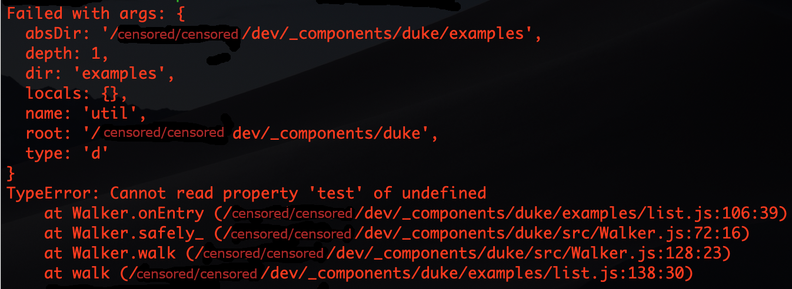

# dwalker [](https://travis-ci.org/valango/duke) [](https://codecov.io/gh/valango/duke)


Rule-based file directory walker - ambitious 
alternative to globber-based directory walkers.

Imagine, you want to count all directory entries anywhere below given directory,
by entry types and get report like this:
```
       directory: 4370
            file: 38392
         symLink: 105
Total 1210 ms (28 µs per item), max directory depth: 8.
The deepest directory:
../sincere/node_modules/resolve/test/resolver/symlinked/_/node_modules
```

How to get there? Just take a look to
[examples/count.js](examples/count.js) 
or better yet - clone the project and play around a bit.

## Usage
**NB:** This package needs Node.js v12.12 or higher.

Install with npm

```
npm i dwalker
```

### How it works
**`Walker`** class instance has `walk()` method,
which does most of the job. It traverses directory hierarchy width-first,
calling application-defined handlers, as it goes. The walk() code
is re-enterable and it can run in parallel promise instances.

Simplified algorithm:
```javascript
function walk (root, {onBegin, onEntry, onEnd}) {
  let action, context, directory
  const fifo = [{ dir: '' }]

  while ((context = fifo.shift()) !== undefined) {
    const { dir } = context
    if ((action = onBegin(context)) === DO_ABORT) return
    if (action === DO_SKIP) continue

    directory = fs.opendirSync(join(root, dir))

    while (({ name, type } = directory.readSync())) {
      action = onEntry({ name, type, ...context })
      if (action === DO_ABORT) discardPushedEntriesAndBreak()
      //  The entries pushed here will be processed next.
      if (action !== DO_SKIP && type === 'dir') fifo.push({dir: join(dir, name)})
    }
    directory.closeSync()

    if ((action = onEnd(context)) === DO_ABORT ||
      wasError() && action !== DO_SKIP) {
        return
    }
  }
}
```
Application - specific handlers `onBegin`, `onEnd`, `onEntry` and 
`onError` are all optional, but 
`Walker` just won't do much good without them.

Things really get exciting, when we apply some business logic in our handlers.
See [another example](examples/list.js).

## Package exports
### Class `Walker`

**`constructor([options])`** <br />
the `options : object` argument may contain default handlers for `walk()`.

**`failures`**: `Array<string>` property <br />
Can be examined any time.

**`options`**: `object` property <br />
is copy of constructor options. `walk()` method looks here for default handlers.

**`terminate`**: `boolean` property <br />
assigning _Truey_ value prevents any further walking.

**`registerFailure(failure, [comment])`**: `Walker` method<br />
If `failure` is no string, then it's `toString()` method is used to
retrieve message text to be pushed into `failures` array.
If `comment : string` is present, it will be appended to message after `'\n  '` string.

**`walk(rootDir, [handlers])`**: `Walker` method<br />
does the walking from `rootDir` down.
If no `handlers : object` specified, it uses those found in `options` property.

### Class `Ruler`
_`Walker`_ is not directly dependent on this class, but it is designed specially
to work with it, so enjoy!

**`constructor([options], [...rules])`** <br />
calls if `rules` are supplied, `add()` method  invoked. Available `options` are:
   * `action : number   ` - initial value for `defaultAction` property.
   * `extended : boolean` - enables sets '{a,b}' -> '(a|b)'; default: `true`.
   * `optimize : boolean` - enables rule optimization; default: `true`.

**`defaultAction`**: `integer` property <br />
default action to be bound to new rule.
This value is used and possibly mutated by `add()` method.

**`add(rules, [action])`**: `Ruler` method <br />
adds new `rules : *`. Any numeric item in rules array
will be treated as action code for further rules and will override
the `action : number` argument. Rules array mey be nested for clarity.
Both code lines in the following example are functionally identical: 
```javascript
r.add([DO_SKIP, 'node_modules', '.*', DO_DEFAULT, '*.js', 'test/*spec.js'])
r.add(['node_modules', '.*'], DO_SKIP).add([DO_DEFAULT, '*.js', 'test/*spec.js'])
```

**`dump()`**: `Array<Array>` method <br />
returns clone of the internal rule tree - useful for diagnostics and testing.

**`match(string, [ancestors])`**: `Array<*>` method <br />
does the rule matching using `ancestors : Array<*>` context possibly resulting
from earlier call to `match()` method.
In most cases, it's far easier to use `test()` method instead.

**`test(string, [ancestors])`**: `[action, ancestors]` method <br />
matches the string against existing rules using `ancestors : Array<*>` context. 
The `action : number` part of return value is relevant to business logic;
`ancestors` part can be used for the next call if action part is `CONTINUE`.

### Constants
See [definitions](src/definitions.js). Action codes defined by application code
should be non-negative integers - this is important!

### Helper functions
**`loadFile(filePath, [nicely])`**: `*` function <br />
reads file synchronously and returns `Buffer` instance.
Returning `undefined` means the file did not exist.

Setting `nicely : boolean` to _truey_ value prevents throwing any exception.
If exception occur, then just `Error` instance is returned by function.

**`typeName(type)`**: `string | undefined` function <br />
translates single-character type id used by `Walker` to human-readable string.

## Handler functions
If handler is not arrow function, it's `this` variable will be set to calling
_`Walker`_ instance.

The context argument supplied to handler contains following properties:
   * `absDir `- absolute path of the directory to be opened;
   * `depth  `- dept in directory tree (0 for root);
   * `dir    `- local name the directory to be opened ('' for toot itself);
   * `locals `- reserved for application code.
   * `root   `- _`rootDir`_ argument supplied to _`walk()`_ method.
   
Common return codes from handler and their effect:
   * `DO_TERMINATE` - all walking is terminated for this _`Walker`_ instance;
   * `DO_ABORT` - discard the current operation, exit to previous level;
   * `DO_SKIP` - skip this item;

**`onBegin(context)`**: `*` handler <br />
is called before directory itself is opened. Special effects of return codes:
   * `DO_ABORT` - `walk()` will return immediately;
   * `DO_SKIP` - skip this directory without trying to open it later;

**`onEntry(context)`**: `*` handler <br />
is called for every entry read from the directory. Context has extra fields:
   * `name `- ...of directory entry;
   * `type `- ...of directory entry (one of exported **`T_...`** constants);

If type is `T_DIR`, and handler returns an object, then this object
will be available on this child directory level via `context.locals`.

**`onEnd(context)`**: `*` handler <br />
is called when all _`onEntry`_ calls are done and the directory is closed.

**`onError(error, args)`** : `*` handler <br />
is called when exception is caught with `args : *` being arguments originally supplied
to failed function (a handler or `fs.readdirSync`).
The following return values have special effect:
   * `undefined` invokes default error processing;
   * `DO_SKIP` prevents `registerFailure()` from being called.

### Default error processing
Depending on `error.code` value, the following will happen:
   * `'ENOTDIR'` - error is not logged and `DO_SKIP` is returned from behalf of failed function;
   * `'EPERM'` - error is logged and execution continues;
   * otherwise it is assumed to be unexpected failure and then:
      * registerFailure() is applied to original arguments of the failed call and then
      to the error instance;
      * DO_ABORT will be returned so this Walker instance finishes walking.
      
Resulting dump of failures property will look something like this:

   
If exception originates from `onEnd` handler and final code is not `DO_SKIP`,
then `walk()` will return immediately.

## Asynchronous operation
There is a demo of asynchronous parallel operation in [examples/list.js](examples/list.js).
It's kinda cool, but in closer look, there is not much benefit - actually -
async mode performance is no better at all. It is natural, because the `walk()` code
_is_ synchronous. So all we'd get from asynchronous operation is being challenged
by lurking `EMFILE` psycho. There is
a [ticket](https://github.com/valango/duke/issues/3) open for discussions on this topic.

Be sure to check for this README sometimes via 
[npm](https://www.npmjs.com/package/dwalker) _homepage_ link or directly in github.
I'll try to
not update [npmjs.com](https://www.npmjs.com) too often. ;)
