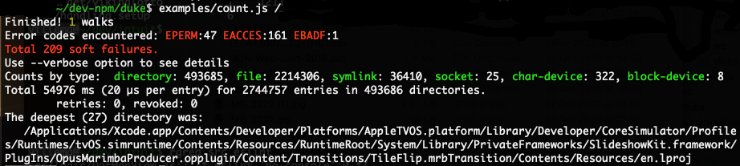

# dwalker [](https://travis-ci.org/valango/duke) [](https://codecov.io/gh/valango/duke)


Asynchronous rule-based file system walker. It:
   * does things most regexp-based walkers hardly can;
   * uses super simple rule definitions;
   * handles most file system errors by default;
   * provides powerful extendable API;
   * runs real fast.

This is what a simple [demo app](doc/examples.md) does on my old 2,7 GHz MacBook Pro:


The version 5 is hugely different from its [ancestors](#version-history).

## Usage
**NB:** This package needs Node.js v12.12 or higher.

Install with yarn or npm
```
yarn add dwalker   ## npm i -S dwalker
```
The following code walks all given directory trees in parallel, gathering basic statistics:
```javascript
const walker = new (require('dwalker')).Walker()
const dirs = '/dev ..'.split(' ')

Promise.all(dirs.map(dir => walker.walk(dir))).then(res => {
  console.log('Finished!', res.length)
}).catch(error => {
  console.log('Exception!', error)
}).finally(() => {
  console.log(walker.stats)
})
// -> Finished! 2
// -> { dirs: 2471, entries: 16181, errors: 2472, retries: 0, revoked: 0 }
```
### How it works
The _`Walker#walk()`_ method recursively walks the directory tree width-first.
A _**walk**_ is a code execution sequence from _`walk()`_ method call until settling
a promise returned by the call. Parallel calls result in a **_batch_**.
Here is a simplified description, of what _`Walker`_ does during a _walk_:
   1. picks a _walk context_ from fifo;
   1. checks the _`visited`_ instance property and skips the directory if it's already there;
   1. calls the _`onDir`_ handler;
   1. opens the directory using Node.js `fs.promises.opendir`;
   1. loops over all directory entries, calling _`onEntry`_ handler every time;
   1. closes the directory;
   1. calls the _`onFinal`_ handler;
   1. for all _entries_ of _`T_DIR`_ type, pushes a new walk context into fifo.

In case of error, the _`onError`_ handler gets its turn.

Every _handler_ has access to current _walk context_ and to _`Walker`_ instance via _`this`_.
What happens next, depends on its return value. This value is usually a numeric
**_action code_** - a predefined or application specific one. A non-numeric return value
terminates a particular walk immediately and resolves the promise.

## API
### exports
   * [_**`Walker`** class_](#walker-class)
   * [_**`Ruler`** class_](doc/ruler.md)
   * [_constants_](src/constants.js)
   * [_common helpers_](#common-helpers)
   
Types referred to below are declared in [src/typedefs.js](src/typedefs.js).

### _`Walker`_ class
The most of the magic happens here. 
A brief overview of its [core concepts](doc/walker-concepts.md) may help
to navigate in further details.

**`constructor`**`(options : {TWalkerOptions})`<br />
   * `data : object = {}` - a shallow copy will be assigned to _`data`_ property.
   * `interval : number=` - instance property setting.
   * `rules : *` - [rule definitions](#rules), or a _`Ruler`_ instance to be cloned.
   * `symlinks : boolean=` - enable symbolic links checking by _`onEntry()`_ handler.

_Walker_ instance stores given (even unrecognized) options in private _`_options`_ property.

#### Walker instance methods

**`avoid`**`(...path) : Walker` - method<br />
Injects the _paths_ into _`visited`_ collection thus preventing them from being visited.
The arguments must be strings or arrays of strings - absolute or relative paths.

**`getOverride`**`(error) : number` - method<br />
Returns overriding action code current error and context.
Walker calls it internally and assigns its numeric return value
to `error.context.override` before calling `onError()` handler. Non-number return value
has no effect.

**`halt`**`([context,] [details]) : Walker` - method<br />
Sets up the **_STC_** _(Shared Terminal Condition)_; has no effect if it is already set.

**`onDir`**`(context: TWalkContext) : *` - _async_ handler method<br />
Called before opening the directory. Default just returns `DO_NOTHING`.

**`onEntry`**`(entry: TDirEntry, context: TWalkContext) : *` - handler method<br />
Called for every entry in the current directory. Default calls _`context.ruler.check()`_,
stores the results it the entry instance and returns the _`check()`_ return value.
This is the only place, where the _`Walker`_ actually checks the [rules](#rules).

**`onError`**`(error: Error, context: TWalkContext) : *` - handler method<br />
Called with trapped error after _`error.context`_ has been set up.
Default just returns _`error.context.override`_.
Returned action code will be checked for special values; a non-numeric return means this
was an unexpected error rejecting the _walk_ promise.

Walker may provide the following _`context.locus`_ values:
`'onDir', 'openDir', 'iterateDir', 'onEntry', 'closeDir', 'onFinal'`.
Overriding handlers may define their own locus names.

**`onFinal`**`(entries : [], context: TWalkContext, action : number) : number` - _async_ handler method<br />
Called after all entries checked and directory closed.
The _`action`_ is the highest action code returned by previous handlers in this cycle.
Returning `DO_SKIP` or higher prevents walking any sub-directories.
Default just returns `action`.

**`reset`**`([hard : boolean]) : Walker` - method<br />
Resets a possible _STC_. In a _hard_ case, it resets all internal state properties,
including those available via _`stats`_.
Calling this method during walk throws an unrecoverable error.

**`tick`**`(count : number)` - method<br />
Called during walk automatically. Default does nothing. 
Override this for progress monitoring etc.

**`trace`**`(handlerName, result, context, args)` - method<br />
Called right after every handler call. Use this for debugging / tracing only.
Default does nothing.

**`walk`**`(startPath : string, [options : TWalkOptions]) : Promise` - method<br />
Walks the walk. The _`startPath`_ may be any valid pathname defaulting to _`process.cwd()`_.
Via _`options`_ you can override  _`trace()`_ method, any _handler methods_, as well as 
_`data`_ and _`ruler`_ instance properties. 
The promise resolves to _`data`_, to non-numeric return value from a handler or
rejects to unexpected error instance.

#### Walker instance properties
**`data`**` : *` - will be available to all _walks_.

**`duration`**` : number` - microseconds elapsed from start of the current _walk batch_
or duration of the most recent batch.

**`failures`**` : Error[]` - all errors overridden during walk. The error instances
will have a `context : TWalkContext` property set.

**`halted`**` : *` - a non-`undefined` value means _STC_.
**Do not mutate** it directly, use _`halt()`_ method instead!

**`interval`**` : number = 200` - minimal msecs between _`tick()`_ calls, 0 disables ticking.

**`ruler`**` : Ruler r/o` - initial ruler instance for a new walk.

**`stats`**` : Object r/o` - general statistics as object with numeric properties:
   * `dirs` - number of visited directories;
   * `entries` - number of checked directory entries;
   * `errors` - number of exceptions encountered;
   * `retries` - number of operation retries (e.g. in case of out of file handles);
   * `revoked` - number of directories recognized as already visited (may happen with **`symlinks`** option set);
   * `walks` - number of walks currently active.
   
**`visited`**` : Map r/o` - a Map instance keyed with absolute directory paths.
Data values have no meaning to Walker, but may have one for application code.

**`walks`**` : number r/o` - number of currently active walks.

#### Walker class methods and properties

**`newRuler`**`(...args) : Ruler` - factory method.

**`overrides`**` : Object` - error override rules as tree:
( handlerName -> errorCode -> actionCode ).

**`shadow`**` : atring[]` - mask for omitting certain parts of context parameter,
before injecting it to Error instance for logging.

#### Walker protected API
Is described in a [separate document](doc/walker-protected.md). 

### Common helpers
Those helpers are available via package exports and may be useful on writing handlers.

**`checkDirEntryType`**`(type : TEntryType) : TEntryType` - function<br />
returns the argument if it is a valid type code; throws an assertion error otherwise. 

**`dirEntryTypeToLabel`**`(type : TEntryType, [inPlural : boolean]) : string` - function<br />
returns human readable type name for valid type; throws an assertion error otherwise. 

**`makeDirEntry`**`(name : string , type : TEntryType, [action : number]) : TDirEntry` - function<br />
constructs and returns a ned directory entry with _`action`_ defaulting to `DO_NOTHING`.

**`makeDirEntry`**`(nativeEntry : fs.Dirent) : TDirEntry` - function<br />
returns a new directory entry based on 
[Node.js native one](https://nodejs.org/dist/latest-v14.x/docs/api/fs.html#fs_class_fs_dirent).

### Special helpers
To use those helpers, load them first, like:
```javascript
const symlinksFinal = require('dwalker/symlinksFinal')
```
**`relativize`**`(path, [rootPath, [prefix]]) : string` function.<br />
Strips the _`rootPath`_ (defaulting to _`homeDir`_)part from given `path`, if it is there.
Optional _`prefix`_ string will be applied to resulting relative path.
May help to make some reports easier to read.

**`relativize.homeDir`**` : string` - initialized to _current user's home directory_.

**`symlinksFinal`**`(entries, context) : *` async handler.<br />
Use it inside _`onFinal`_ handler for following the symbolic links.
Example:
```javascript
const onFinal = function (entries, context) {
  return this._useSymLinks
    ? symlinksFinal.call(this, entries, context) : Promise.resolve(0)
}
```

### Rules
Rules are defined as action code followed by any number of file patterns, 
quite similar to _bash_ glob patterns or _.gitignore_ rules. Example:
```javascript
ruler.add(
  DO_SKIP, '.*/', 'node_modules/', '!/test/**/node_modules/',
  DO_CHECK, 'package.json', 'LICENSE', '*;l')
```
Here the first two rules generated will result in DO_SKIP when matching the name
of entry of T_DIR type. The third rule tells not to skip node_modules
anywhere under the topmost 'test' directory. The rules 3, 4 will be matched
against any entries except of T_DIR type.
The last rule (with **_explicit type_**) matches against T_SYMLINK entries only.
<br />Without _explicit type_, all rules created are typeless or `T_DIR` ('d').
Explicit type must match one in `S_TYPES` constant.

Behind the scenes, a _`Ruler`_ instance creates and interprets a _**rule tree**_
formed as an array on records <br/>
_`(type, expression, ancestorIndex, actionCode)`_.
For the above example, the _`Ruler` dump_ would be:
```
         0: 'd' null,               -1, 0,
         1: 'd' /^\./,               0, 2,
         2: 'd' /^node_modules$/,    0, 2,
         3: 'd' /^test$/,           -1, 0,
         4: 'd' null,                3, 0,
         5: 'd' /^node_modules$/,    4, -2,
         6: ' ' /^package\.json$/,   0, 1,
         7: ' ' /^LICENSE$/,         0, 1,
         8: 'l' /./,                 0, 1,
_ancestors: [ [ 0, -1 ] ]

```
The internal _`ancestors`_ array contains tuples _`(actionCode, ruleIndex)`_.

The _`Ruler#check()`_ method typically called from _`Walker#onEntry()`_ finds
all rules matching the given entry _`(name, type)`_ and fills in the
lastMatch array, analogous to ancestors array. Then it returns the most
prominent (the highest) action code value. A negative value screens the actual one.

The sub-directories opened later will inherit new _`Ruler`_ instances with _`ancestors`_
set to _`lastMatch`_ contents from the upper level.
So, the actual rule matching is trivial, and the rules can be switched dynamically.

For further details, check the [_`Ruler`_ reference](doc/ruler.md) and
the special [demo app](doc/examples.md#parsejs). 

## Version history
* v5.1.0 @20201121
   - removed: hadAction(), hasAction() Ruler instance methods.
* v5.0.0 @20201120
   - Walker totally re-designed (_a **breaking** change_);
   - Ruler#check() refactored (_a non-breaking change_);
   - documentation and examples re-designed.
* v4.0.0 @20200218
   - several important fixes;
   - Walker throws error if on illegal action code returned by handler;
   - added: Walker#expectedErrors, removed: Walker#getMaster;
   - added: check(), hadAction(), hasAction() to Ruler, removed: match();
   - up-to-date documentation;
* v3.1.0 @20200217
* v3.0.0 @20200211
* v2.0.0 @20200126
* v1.0.0 @20200124
* v0.8.3 @20200123: first (remotely) airworthy version.
