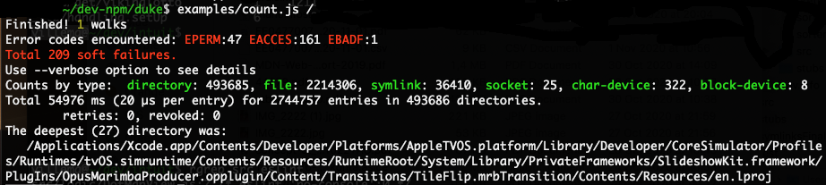
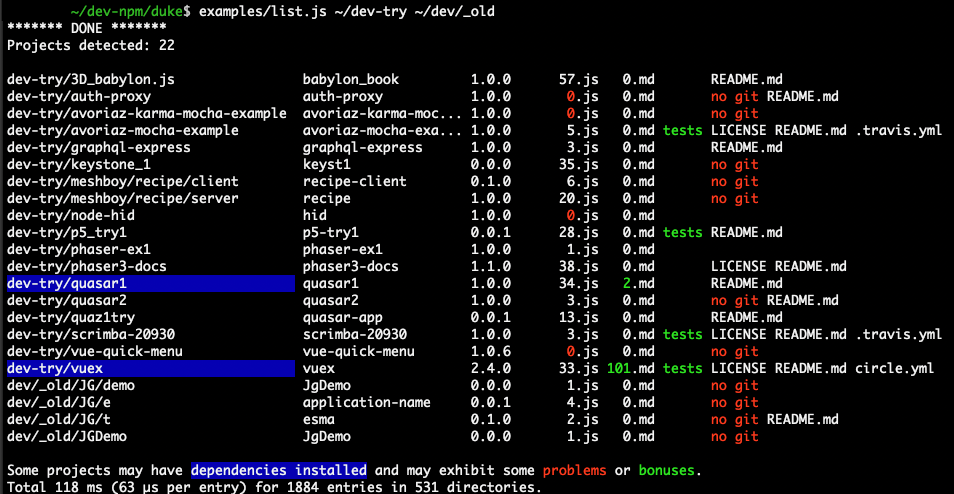

## Examples

_**Note:** clone the source repository first to actually play with examples._

There are some examples in [examples/](../examples) directory.
To run, type in a terminal something like:
```shell script
   examples/count.js -h
```

### count.js
[This simple application](../examples/count.js) demonstrates minimalistic use of Walker.

Just 30 code lines do all the business logic - the rest are wrapping the eye candy.
Hey - it even finds and tracks _symbolic links_ and reports the broken ones! ;).


### list.js
[This slightly more complex application](../examples/list.js) finds npm projects
and does some simple analysis on them. 

This code demonstrates dynamic strategy, rules swithcing and other techniques.


### parse.js
[This demo](../examples/parse.js) interprets command line arguments as rule definitions,
constructs a `Ruler` instance and dumps it's contents.

This tool helps developer to experiment with rule stuff and understand the details.
